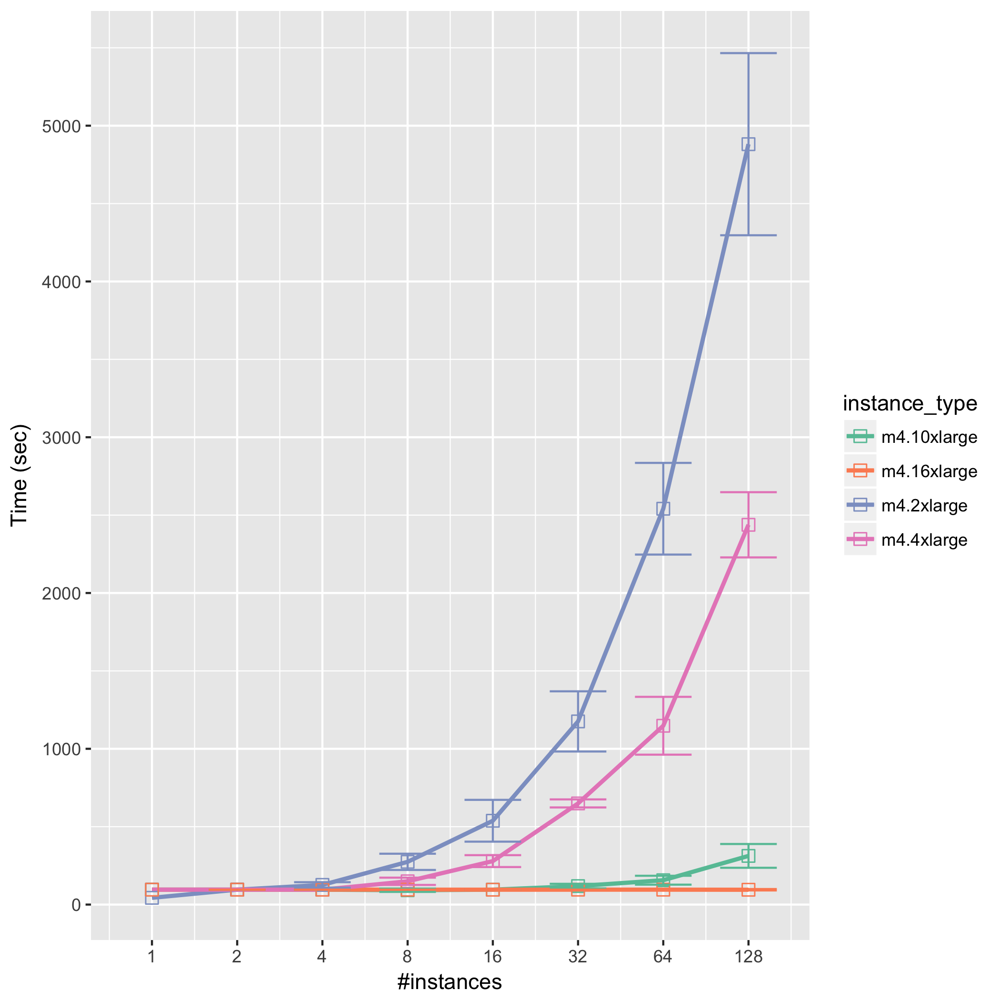

# Purpose

This project is for creating figures which can indicate that

- The more concurrent computing instances mount shared instance, the more time it would take.
- The stronger shared instance is used, the faster the computing times should be.

# Method

- cross measurement for
    1. several concurrency with specific Shared-Instance type
    2. several Shared-Instance type with specific concurrency

# Expected

```
time
|              .
|             .
|          .
|      . 
|. .  
|________________________ concurrency
```

# Protocol

## 1. Generate test dataset table

```sh
python ./gen_tasks.py
```

## 2. Run benchmark script on any cases

Run `bwa mem` with shared-data-instance type `m4.10xlarge` and `16` concurrency.

```sh
./benchmark.sh m4.10xlarge 16
```

## 3. Summarize result datasets

```sh
./summarize.sh
```

# Assets

- `Dockerfile`: a recipe for [`otiai10/bwa`](https://hub.docker.com/r/otiai10/bwa/) on which BWA works
- `bwa-mem.sh`: the main script to run `bwa mem` on computing instances
- `gen_tasks.py`: only to generate messy CSV files, which I don't wanna include git repository
- `benchmark.sh`: the main driver for this test, hit `./benchmark.sh` to show help message
- `summarize.sh`: to summarize all the result dataset and create figures
    - `compile.R`: to calculate `min`, `max`, `mean` and `std` of each dataset
    - `figure.R`: to create figures by using `ggplot`

# Results

