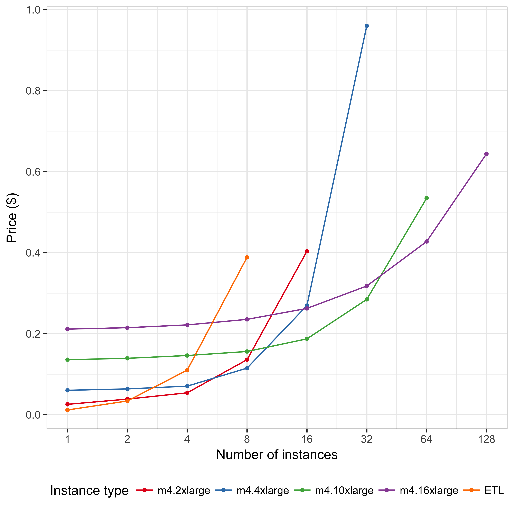

# Purpose

To evaluate price of BWA alignment by ExTL comparing with by ETL.

# Definitions

| variable name | meaning | unit | note |
|----:|:-----|:------:|:-------|
| `D` | Price of downloading data from storage | `$/GB` | |
| `s` | Size of reference data | `GB` | |
| `t1(n)` | Time for computing | `sec` | measured value |
| `t2(s)` | Time for downloading reference data | `sec` | measured value |
| `n` | Concurrency number | - | variable |
| `P` | Price of using computing instances | `$/sec` | |
| `p` | Price of block storage for reference data | `$/sec` | |
| `Q` | Price of using shared data instance | `$/sec` | |

## ETL

```
ETL ($) = (D * s + (P+P') * (t1+t2)) * n
```

## ExTL

```
ExTL ($) = (D * s + (Q+P') * (t1+t2)) + (P * t1) * n
```

| key | value | reference |
|---:|:----|:----|
| `D` | `0.0008 $/GB` | [*](https://aws.amazon.com/s3/pricing/) |
| `s` | `8 GB` | for BWA alignment |
| `P` | `0.129 $/Hour` === `0.000035833333333333335 $/sec` | [*](https://aws.amazon.com/ec2/pricing/on-demand/) m4.large |
| `p` | `0.10 $/Month` === `3.858024691358025e-8 $/sec` | [*](https://aws.amazon.com/ebs/pricing/) |
| `Q` | `1.032 $/Hour` === `0.0002866666666666667 $/sec` | [*](https://aws.amazon.com/ec2/pricing/on-demand/) m4.4xlarge |

case: BWA-alignment with SDI m4.4xlarge

# Results


